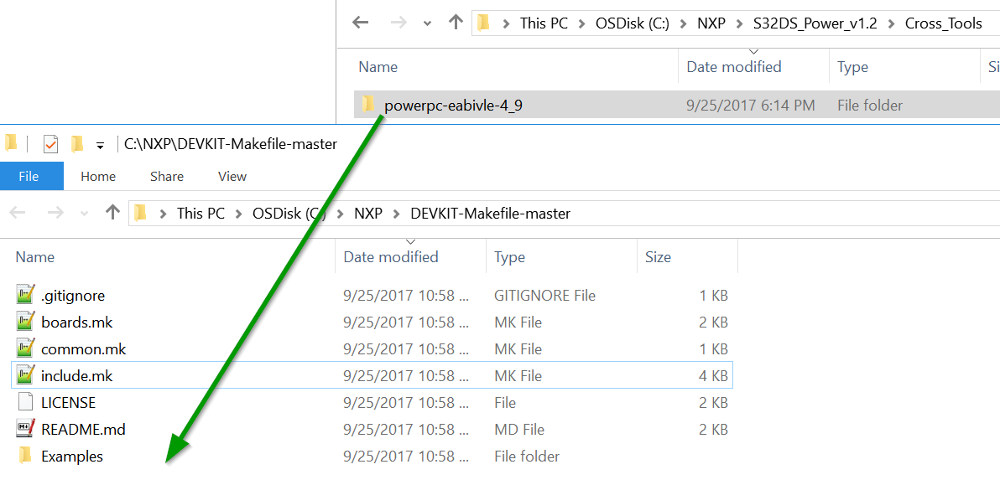
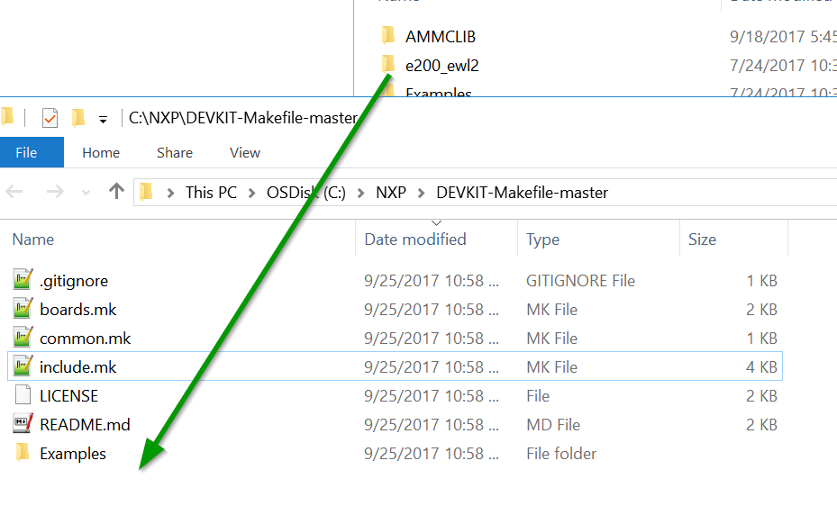

# DEVKIT-Makefile
Makefiles for NXP's DEVKIT-MPC57xx boards. Modeled after the [Arduino Makefile](https://github.com/sudar/Arduino-Makefile) project.

Needs the [S32DS for Power Architecture](https://www.nxp.com/support/developer-resources/run-time-software/s32-design-studio-ide/s32-design-studio-ide:S32DS?&tab=Design_Tools_Tab) to get started. I didn't want to risk waking NXP's lawyers so none of NXP's files are bundled.


## Usage

```Makefiles``` for all of the DEVKIT-MPC5744P examples are provided. It expects the following folder structure:

    <ProjectName>/src     # .c files
    <ProjectName>/include # .h files

Copy the Examples directory from S32DS plugins or create a new project. Edit the minimal Makefile below to point to the correct directory.

Given the folder layout: ```DEVKIT-Makefile\Examples\MPC5744P\ADC_MPC5744P``` a minimal makefile:

	MCU:=MPC5744P

	E200MK_DIR:=../../..
	include ${E200MK_DIR}/include.mk

1. Defines the MCU
2. Include ```include.mk```

Run:

    make [all] # Makes all binaries
    make elf # Make .elf
    make hex # Make .hex
    make bin # Make .bin
    make s19 # Make .s19

## Flashing

Integrated with [opensda_flasher](https://github.com/jed-frey/opensda_flasher). Will flash a project to the development board.

    make flash

# Installation

1. Download this repo: https://github.com/jed-frey/DEVKIT-Makefile/archive/master.zip

2. Unzip somewhere.

3. Copy files from your S32DS installation. Once this is complete you can move the folder to another computer or uninstall S32DS. 

Copy ```S32DS_Power_v1.2\powerpc-eabivle-4_9``` to this directory.




Copy ```S32DS_Power_v1.2\S32DS\e200_ewl2``` to this directory.



Copy linker .ld files and startup.S file into a directory named ```MPC5744P```.


## TODO

- ```make clean``` on Windows.
- Document all the ENV variables.
- DEVKIT-MPC5748G
- WindRiver DIAB Compiler

## Make

This requires GNU Make >4.0

https://blog.melski.net/2015/01/12/whats-new-in-gnu-make-4-1/

> The $(file) function was added in GNU make 4.0 to enable writing to files from a makefile without having to invoke a second process to do so. For example, where previously you had to do something like $(shell echo hello > myfile), now you can instead use $(file > myfile,foo). In theory this is more efficient, since it avoids creating another process, and it enables the user to easily write large blocks of text which would exceed command-line length limitations on some platforms.

I used the [nuwen.neet MingGW Distro](https://nuwen.net/mingw.html) on Windows 10. Install it and add it to your PATH.